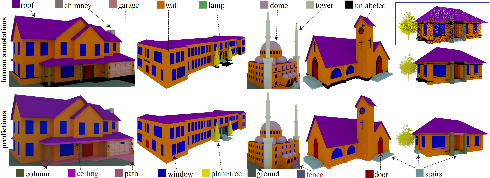
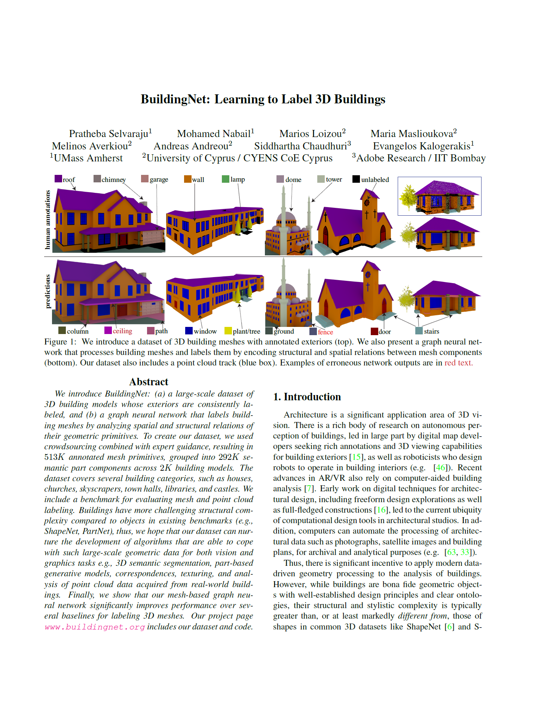

<p align="center">
  <a href="https://www.linkedin.com/in/prathebaselvaraju">Pratheba Selvaraju</a><sup>1</sup> &emsp;
  Mohamed Nabail<sup>1</sup> &emsp;
  <a href="https://marios2019.github.io/">Marios Loizou</a><sup>2</sup> &emsp;
  Maria Maslioukova<sup>2</sup> &emsp;
  <br>
  <a href="https://melinos.github.io/">Melinos Averkiou</a><sup>2</sup> &emsp;
  Andreas Andreou<sup>2</sup> &emsp;
  <a href="https://www.cse.iitb.ac.in/~sidch/">Siddhartha Chaudhuri</a><sup>3</sup> &emsp;
  <a href="https://people.cs.umass.edu/~kalo/">Evangelos Kalogerakis</a><sup>1</sup>
  <br>
  <br>
  <sup>1</sup>UMass Amherst &emsp;
  <sup>2</sup>University of Cyprus / CYENS CoE &emsp;
  <sup>3</sup>Adobe Research / IIT Bombay
</p>
<br>

<div align="center">
    
</div>

<h1 align="left">Abstract</h1>
<p align="justify">We introduce BuildingNet: (a) a large-scale dataset of 3D building models whose exteriors are consistently labeled, and (b) a graph neural network that labels building meshes by analyzing spatial and structural relations of their geometric primitives. To create our dataset, we used crowdsourcing combined with expert guidance, resulting in 513K annotated mesh primitives, grouped into 292K semantic part components across 2K building models. The dataset covers several building categories, such as houses, churches, skyscrapers, town halls, libraries, and castles. We include a benchmark for evaluating mesh and point cloud labeling. Buildings have more challenging structural complexity compared to objects in existing benchmarks (e.g., ShapeNet, PartNet), thus, we hope that our dataset can nurture the development of algorithms that are able to cope with such large-scale geometric data for both vision and graphics tasks e.g., 3D semantic segmentation, part-based generative models, correspondences, texturing, and analysis of point cloud data acquired from real-world buildings. Finally, we show that our mesh-based graph neural network significantly improves performance over several baselines for labeling 3D meshes.</p>

<h1 align="left">Paper</h1>
<a href="https://drive.google.com/file/d/1aD5AIkx58k7EyK8Utg8vKv2Y_UMZ--pv/view?usp=sharing"></a>
<a href="https://drive.google.com/file/d/1aD5AIkx58k7EyK8Utg8vKv2Y_UMZ--pv/view?usp=sharing">BuildingNet.pdf</a>, 17.3MB
<h3 align="left">Citation</h3>
<p style="padding-right: 10px" align="left">Pratheba Selvaraju, Mohamed Nabail, Marios Loizou, Maria Maslioukova, Melinos Averkiou, Andreas Andreou, Siddhartha Chaudhuri, Evangelos Kalogerakis, "BuildingNet: Learning to Label 3D Buildings", <em>Proceedings of the IEEE/CVF International Conference on Computer Vision (ICCV)</em>, 2021</p>
<br>
<a href="https://drive.google.com/file/d/1LqCN82l9zYjtjYlPM-2_tQIYWFowOMo0/view?usp=sharing">Bibtex</a>

```
@inproceedings{Selvaraju:2021:BuildingNet, 
  author = {Pratheba Selvaraju and Mohamed Nabail and Marios Loizou and Maria Maslioukova and
            Melinos Averkiou and Andreas Andreou and Siddhartha Chaudhuri and Evangelos Kalogerakis},
  title = {BuildingNet: Learning to Label 3D Buildings},   
  booktitle = {IEEE/CVF International Conference on Computer Vision (ICCV)},
  year = {2021}   
}   
```

<p align="justify"><small>Additional supplementary material: a few video examples of UI operations used for labeling - <a href="https://drive.google.com/file/d/1zpX1a0osTZyvALw0BdaTTjbY3HzsSMJQ/view?usp=sharing">video_UI_tutorial_parts.zip</a>.</small></p>

<h1 align="left">Presentation at ICCV</h1>

<a href="https://drive.google.com/file/d/10jUM0stW9op50bvO6tZu8WE5jAQpyuWW/view?usp=sharing">Slides in PDF format</a>, 7.4MB.

YouTube video of the presentation:

<div class="embed-container">
  <iframe
      src="https://www.youtube.com/embed/rl30WJo_EBo"
      width="700"
      height="480"
      frameborder="0"
      allowfullscreen="">
  </iframe>
</div>

<h3 align="left">Poster</h3>

<a href="https://drive.google.com/file/d/1QFDnwEiQYfelA5c_QKpKZofnyNlma83I/view?usp=sharing">BuildingNet_poster.pdf</a>, 2.9MB.

<h1 align="left">BuildingNet Challenge</h1>
The BuildingNet Challenge was held in conjunction with the Second Workshop on 
<a href="https://struco3d.github.io/cvpr2023/">Structural and Compositional Learning on 3D Data</a> @ CVPR 2023 Vancouver 
(Canada).The challenge focused on the task of part segmentation of 3D buildings. For the purposes of this challenge
the newly released BuildingNet v1 dataset was used. For more information please visit the challenge website on 
<a href="https://eval.ai/web/challenges/challenge-page/1938/overview">EvalAI</a>. 

<h3 align="left">Challenge presentation</h3>

<a href="https://drive.google.com/file/d/1uKjvk2rIQh0A1sli_eEPF1gQsrbiFpr_/view?usp=sharing">Slides in PDF format</a>, 6.4MB.
<br><br>
YouTube video of the challenge presentation at the 2nd <a href="https://struco3d.github.io/cvpr2023/">StruCo3D</a> (CVRPW):

<div class="embed-container">
  <iframe
      src="https://www.youtube.com/embed/84UTtyRPqDA"
      width="700"
      height="480"
      frameborder="0"
      allowfullscreen="">
  </iframe>
</div>


<h1 align="left">Dataset and Code</h1>
<p align="justify">The official implementation can be found in our <a href="https://github.com/buildingnet/buildingnet_dataset">github repository</a>. Please fill in <a href="https://forms.gle/jFQpoRzRkrTCaTzX8">this form</a>, in order to get access to the official release of the BuildingNet dataset.</p>
